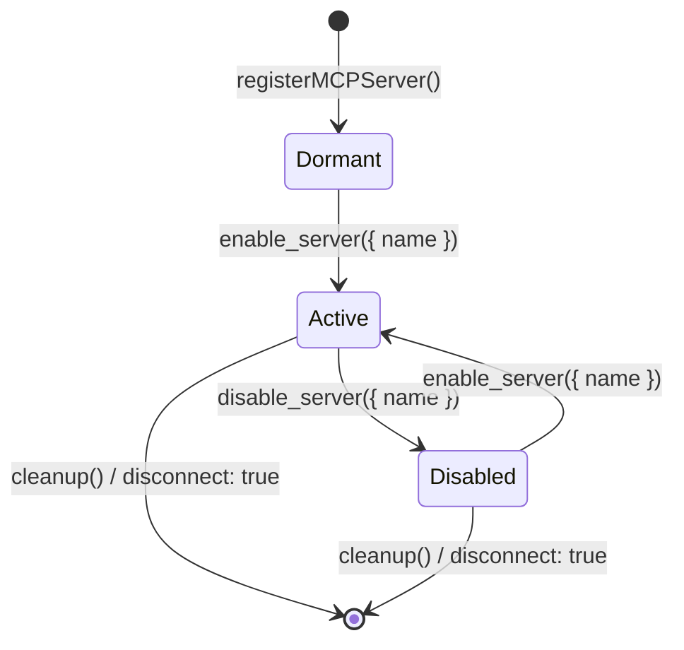

# Lazy MCP Servers (Deferred Connections)

Connecting to every configured Model Context Protocol (MCP) server at startup pays an expensive **connection tax**: spawning child processes for Stdio transports, performing TLS/HTTP handshakes for Streamable HTTP transports, and fetching initial tool lists for capabilities that a specific run may never touch.

In environments with dozens of potential integrations (e.g. GitHub, Jira, Postgres, Slack, CloudWatch, Kubernetes), this startup latency degrades user experience and consumes unnecessary system resources.

`agentlib` addresses this with **Lazy MCP Servers** (Phase 3), deferring connection, transport initialization, and tool indexing until the agent or model explicitly requests them mid-run.

---

## Core Concepts

### 1. Eager vs. Lazy MCP Servers

| Capability | Eager (`addMCPServer`) | Lazy (`registerMCPServer`) |
|---|---|---|
| **Connection Time** | Startup / Initialization | On-demand (mid-run) |
| **Startup Cost** | Process spawn / Network handshake | 0 ms (memory blueprint record) |
| **Tool Catalog** | Tools indexed immediately | Tools indexed when enabled |
| **Discovery** | Direct catalog exposure or progressive tool search | Server meta-tools (`search_servers`, `enable_server`) |
| **Best For** | Core, guaranteed servers (e.g. primary database) | Specialized, optional, or many servers |

Existing code using `agent.addMCPServer(name, config)` or `toolLoader.addMCPServer(name, config)` remains 100% backward compatible and continues to connect eagerly.

---

## The Lazy Server Lifecycle



1. **Dormant**:
   The server blueprint and natural language description are registered. No child process is spawned, no network request is sent, and no tools appear in the catalog.
2. **Active**:
   When triggered (either by the model calling `enable_server` or programmatically via `agent.enableMCPServer`), `agentlib` connects to the MCP server, queries its tools via `list()`, validates tool names against collision, indexes them into `ToolLoader`, and emits `mcp:server_enabled`.
3. **Disabled**:
   When deactivated, tool declarations are removed from the active catalog and `mcp:server_disabled` is emitted. By default, the underlying transport connection is kept warm (`disconnect: false`), avoiding reconnection overhead if the server is re-enabled later.

---

## Server Meta-Tools

When one or more lazy MCP servers are registered, `agentlib`'s tool exposure policies automatically provide three meta-tools to the model:

### 1. `search_servers`
Enables the model to discover which dormant or active servers can handle a given task.
- **Parameters**:
  - `query` (`string`, required): Natural language search query describing the capability needed.
  - `limit` (`number`, optional): Maximum number of results to return (default: 5).
- **Matching Algorithm**: Uses zero-dependency BM25 keyword ranking across server names and descriptions.
- **Response**: List of matching servers with their name, status (`dormant`, `active`, `disabled`), and description.

### 2. `enable_server`
Connects and activates a registered server mid-run.
- **Parameters**:
  - `name` (`string`, required): Name of the MCP server to enable.
- **Response**: `{ serverName, status: 'enabled', toolsAdded, tools: [...] }`.

### 3. `disable_server`
Deactivates an active MCP server, removing its tools from the catalog.
- **Parameters**:
  - `name` (`string`, required): Name of the MCP server to disable.
- **Response**: `{ serverName, status: 'disabled' }`.

---

## Prompt Caching & Conversation Boundaries

> [!WARNING]
> **Prompt Cache Invalidation Warning**
> Dropping a server's tool definitions from the catalog alters the wire `tools` array, which invalidates the provider's prompt prefix cache. Therefore, **`disable_server` is a conversation-boundary operation**, not a per-turn operation.

### Recommended Disabling Practices:
1. **Keep Connections Warm**: By default, `disableMCPServer(name, { disconnect: false })` keeps the transport connected in the background. If a future conversation enables the server again, no new child process or HTTP handshake is needed.
2. **End-of-Session Disconnect**: Use `agent.cleanup()` or `agent.disableMCPServer(name, { disconnect: true })` when terminating a session or releasing resources.
3. **Session Boundaries**: Only disable servers when resetting an agent between tasks or when moving to an entirely separate workflow.

---

## Usage Guide

### 1. Registering Lazy Servers on an Agent

```javascript
import { Agent, LLMService } from '@peebles-group/agentlib-js';

const llm = new LLMService({ provider: 'gemini', model: 'gemini-2.5-pro' });
const agent = new Agent(llm, { name: 'orchestrator' });

// Register lazy MCP servers (Zero startup latency!)
agent.registerMCPServer('github_server', {
    type: 'stdio',
    command: 'npx',
    args: ['-y', '@modelcontextprotocol/server-github'],
    env: { GITHUB_PERSONAL_ACCESS_TOKEN: process.env.GITHUB_TOKEN },
}, {
    description: 'Manage GitHub repositories, issues, pull requests, and file contents.',
});

agent.registerMCPServer('postgres_server', {
    type: 'stdio',
    command: 'npx',
    args: ['-y', '@modelcontextprotocol/server-postgres', process.env.DATABASE_URL],
}, {
    description: 'Direct SQL querying and schema inspection for customer analytics database.',
});

// Eager servers can still be mixed in for guaranteed services
await agent.addMCPServer('core_tools', {
    type: 'streamableHttp',
    url: 'https://mcp.internal.net/tools',
});
```

### 2. Multi-Turn Model Discovery Flow

When a user asks: *"Can you check open PRs in our repo and query customer orders?"*

1. **Turn 1 (Server Search)**:
   The model inspects available meta-tools and calls `search_servers`:
   ```json
   {
     "name": "search_servers",
     "arguments": { "query": "github pull requests" }
   }
   ```
   **Result**: `{ totalMatches: 1, servers: [{ name: "github_server", status: "dormant", ... }] }`

2. **Turn 2 (Server Activation)**:
   The model enables `github_server`:
   ```json
   {
     "name": "enable_server",
     "arguments": { "name": "github_server" }
   }
   ```
   **Result**: `{ serverName: "github_server", status: "enabled", toolsAdded: 8, tools: ["github_server_list_prs", ...] }`

3. **Turn 3 (Tool Execution)**:
   The model directly invokes the newly loaded tool:
   ```json
   {
     "name": "github_server_list_prs",
     "arguments": { "repo": "org/repo" }
   }
   ```

### 3. Programmatic Control

Developers can also inspect and manage server states programmatically:

```javascript
// Query registered servers and their current status
const servers = agent.toolLoader.getRegisteredMCPServers();
// Returns:
// [
//   { name: 'github_server', status: 'dormant', description: '...', toolCount: 0 },
//   { name: 'postgres_server', status: 'dormant', description: '...', toolCount: 0 },
//   { name: 'core_tools', status: 'active', description: '...', toolCount: 5 }
// ]

// Programmatically enable a server ahead of time for a specific task
await agent.enableMCPServer('postgres_server');

// Programmatically disable when switching workflows
await agent.disableMCPServer('postgres_server', { disconnect: false });

// Complete cleanup on agent disposal
await agent.cleanup();
```

### 4. Combining with Progressive Discovery (`exposeProgressive`)

Lazy servers integrate natively with progressive discovery:
- In `progressive` mode, both tool meta-tools (`search_tools`, `get_tool_details`) and server meta-tools (`search_servers`, `enable_server`, `disable_server`) are available.
- When a server is enabled, its tools are instantly indexed into the catalog.
- If running in `expand` mode, subsequent turns can search or inspect schemas of the new server's tools without blowing up prompt tokens.
