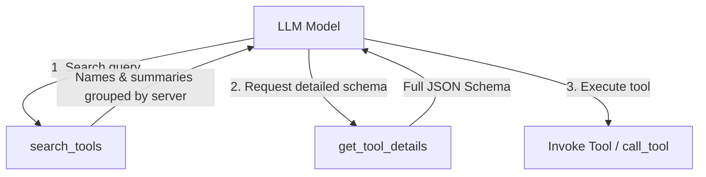

# Progressive Tool Discovery

In large tool catalogs—such as setups connecting dozens of Model Context Protocol (MCP) servers or enterprise microservice registries—eagerly serializing every tool schema upfront into the LLM system prompt introduces significant challenges:

1. **Context Window Exhaustion**: Schemas consume thousands of input tokens on every turn.
2. **Reasoning Degradation**: Models struggle to select the right tool when presented with hundreds of options simultaneously.
3. **High Latency & Costs**: Unnecessary schema tokens increase API costs and time-to-first-token (TTFT).

`agentlib` addresses this with **Progressive Tool Discovery** (Phase 2), decoupling tool registration from wire schema exposure.

---

## Core Concepts

### 1. Exposure Policies

An exposure policy is a pure function that maps the full catalog and the turn's discovery state to this turn's wire declarations:

```javascript
// (catalog, exposureState, context) -> { declarations, metaTools, resolve, nextState }
```

`agentlib` provides three built-in policies:

| Policy | Setting | Description | Default |
|---|---|---|---|
| **Eager** | `'all'` | Exposes all registered tools upfront on the wire. Identical to classic behavior. | Yes (default) |
| **Progressive** | `'progressive'` | Exposes discovery meta-tools (`search_tools`, `get_tool_details`, and optionally `call_tool`) plus any tools discovered in prior turns. | Configurable |
| **Auto** | `'auto'` | Runs eagerly until estimated declaration tokens exceed a fraction of the model context limit (`toolExposureThreshold`), then switches to progressive. | Threshold: 5% (0.05) |

### 2. The 3-Layer Discovery Flow

Under progressive discovery, the model interacts with three layers:



1. **Layer 1: Catalog Search (`search_tools`)**
   - Natural language keyword search powered by a zero-dependency BM25 ranking algorithm.
   - Returns ranked matches grouped by source (MCP server or local origin).
   - Supports three detail levels:
     - `'name_only'`: Minimal payload (`{ name }`).
     - `'name_and_description'` (default): Summary payload (`{ name, description }`).
     - `'full_schema'`: Complete parameter schema (`{ name, description, parameters }`).

2. **Layer 2: Detail Inspection (`get_tool_details`)**
   - Retrieves full parameter schemas for specific named tools.
   - Automatically registers queried tools into the turn's discovered set.

3. **Layer 3: Execution**
   - In **`expand`** mode, discovered tools appear directly on the wire tool list for subsequent turns.
   - In **`facade`** mode, tools are invoked dynamically through `call_tool({ name, arguments })`.

---

## Prompt Caching Strategies: `expand` vs `facade`

When using progressive discovery, `agentlib` supports two prompt caching modes via `toolExposureOptions.mode`:

### `expand` Mode (Default)

- Newly discovered tool schemas are appended to the wire `tools` array on the next turn.
- **Cache behavior**: Prompts leverage provider prefix caching; discovering a new tool triggers a single cache miss, and subsequent turns reuse the extended cache.
- **Model behavior**: The model calls discovered tools using native LLM tool-calling conventions. Provider schema validation is fully enforced.

```javascript
const agent = new Agent(llmService, {
    toolExposure: 'progressive',
    toolExposureOptions: {
        mode: 'expand', // default
    },
});
```

### `facade` Mode

- The wire tool list contains **only fixed meta-tools** (`search_tools`, `get_tool_details`, `call_tool`) and any native provider tools.
- Individual tool schemas are never placed onto the wire `tools` array.
- The model invokes tools via `call_tool({ name: 'server_tool', arguments: { ... } })`.
- **Cache behavior**: 100% stable prefix prompt cache across the entire session; zero cache invalidation regardless of how many tools are used.

```javascript
const agent = new Agent(llmService, {
    toolExposure: 'progressive',
    toolExposureOptions: {
        mode: 'facade',
    },
});
```

---

## Configuration & Usage

### 1. Enabling Progressive Discovery on an Agent

```javascript
import { Agent, LLMService } from '@peebles-group/agentlib-js';

const llmService = new LLMService({ provider: 'anthropic' });

const agent = new Agent(llmService, {
    name: 'research-agent',
    toolExposure: 'progressive', // 'all' | 'progressive' | 'auto'
    toolExposureOptions: {
        mode: 'expand', // 'expand' | 'facade'
    },
});
```

### 2. Auto Policy with Custom Threshold

The `'auto'` policy measures the estimated tokens of all tool declarations against the model's context ceiling. If declarations exceed `thresholdRatio * maxContextTokens`, the agent transparently activates progressive discovery:

```javascript
const agent = new Agent(llmService, {
    toolExposure: 'auto',
    toolExposureOptions: {
        thresholdRatio: 0.05, // 5% of context window (default)
        mode: 'expand',
    },
});
```

### 3. Environment Defaults

Default behavior can be set globally using environment variables:

| Environment Variable | Allowed Values | Default | Description |
|---|---|---|---|
| `AGENTLIB_TOOL_EXPOSURE` | `all`, `progressive`, `auto` | `all` | Global default exposure policy |
| `AGENTLIB_TOOL_EXPOSURE_THRESHOLD` | Float `0.0` - `1.0` | `0.05` | Fraction of context limit triggering `'auto'` switch |
| `AGENTLIB_TOOL_EXPOSURE_MODE` | `expand`, `facade` | `expand` | Prompt caching mode |

### 4. Custom Keyword & Embedding Rankers

By default, `search_tools` uses `rankKeywords`, an in-memory BM25 scorer weighting tool names (3x), descriptions (1.5x), and parameter fields (1x).

You can inject a custom ranker (e.g. vector search or hybrid BM25 + embeddings):

```javascript
const agent = new Agent(llmService, {
    toolExposure: 'progressive',
    toolExposureOptions: {
        rank: async (query, entries, { limit }) => {
            // entries: Array of tool declarations
            // Return: Array<{ entry: object, score: number }> sorted descending
            const embeddings = await myVectorDb.search(query, { limit });
            return embeddings.map(res => ({
                entry: res.metadata.declaration,
                score: res.similarity,
            }));
        },
    },
});
```

### 5. Multi-Turn State Threading & Branching Safety

Discovery state is threaded purely through turn frames and returned on each turn object (`turn.exposure`):

```javascript
const turn1 = await agent.start(context);
console.log(turn1.exposure);
// { mode: 'expand', discovered: ['weather_lookup'] }

// Continue the conversation
const turn2 = await turn1.next();

// Branching time-travel is completely isolated:
const branchedHistory = await agent.branch(turn1, alternateContext);
// branchedHistory inherits turn1's discovered tools without mutating other branches
```

---

## Native Tools Pass-Through

Provider-native tools (such as Gemini's `{ type: 'web_search' }` or OpenAI's file search) are never hidden or indexed by `search_tools`. They remain on the wire array across all policies and modes, ensuring native provider features operate without disruption.

---

## See Also

- [Lazy MCP Servers (`docs/lazy-servers.md`)](lazy-servers.md): Deferring MCP server connections and child process spawning until mid-run discovery.

